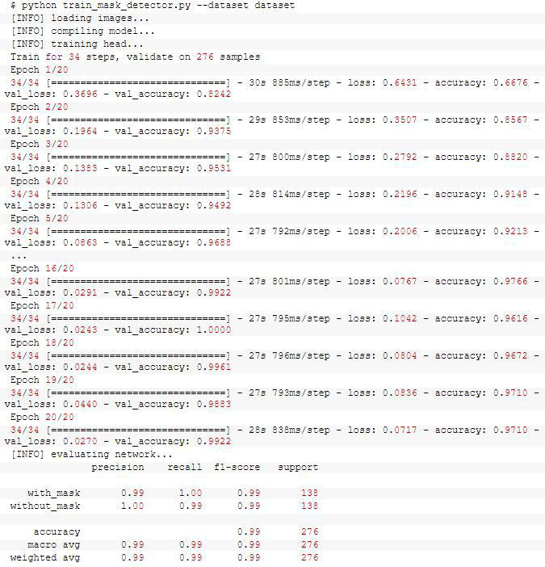

# face-mask-detector
# 1 功能简介

* 口罩，已经成为某些场合出门的标配 , 面对人员流动带来的疫情传播压力，车站、机场、地铁站等场合都严格检查出入人员体温、口罩佩戴情况等。百度在近日开源了一个口罩人脸检测及分类模型，除了识别人脸外，还可判断出他们是否佩戴口罩，识别及分类准确率分别达到 98% 和 96.5%
#### 功能：
* 1，在图像中检测是否佩戴口罩
* 2，实时视频流中的口罩检测

## 2 数据集构建

*此数据集包含1376个图像，属于两个类别：
带口罩：690张图片无口罩：686张图片

#### 2.1 创建数据集
* 1，拍摄人脸的正常图像
* 2，然后创建一个计算机视觉Python脚本来向它们添加口罩，从而创建一个戴口罩的数据集
* 3，面部 landmarks允许我们自动推断面部结构的位置（包括：眼睛 眉毛 鼻子 嘴 下颌线）因此我们可以使用它来帮我们构建数据集

#### 2.2 生成戴口罩数据步骤

* 根据人脸特征点，选取脸颊、鼻子、和下巴中的一点，然后根据脸颊到鼻子和下巴的连线的距离判断口罩的宽窄.（口罩被分为两部分进行填充）

# 3 训练流程

* 训练：在这里，我们将从磁盘加载我们的口罩检测数据集，在此数据集上训练模型（使用Keras/TensorFlow），然后将面罩检测器写入到磁盘
* 部署：一旦面罩检测仪经过训练，我们就可以继续加载面罩检测模型，执行面部检测，然后将每个面部分为带口罩和不带口罩。

#### 3.1 训练结果

#### 3.2 loss和acc

